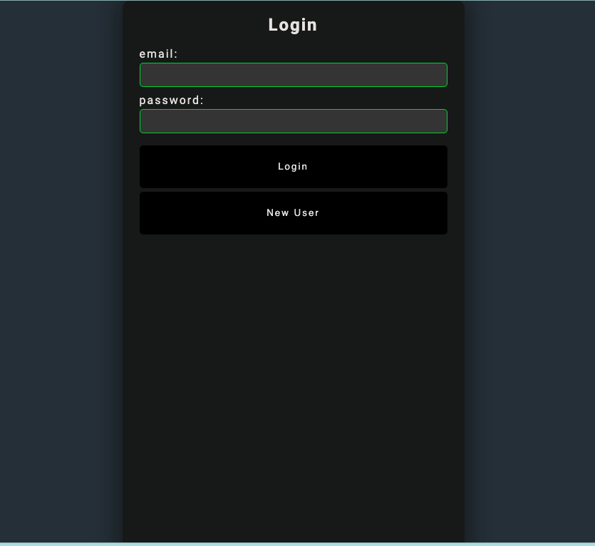

# Restful-Fitness

## __Description__

This application is a fitness-tracking tool designed to provide users with the ability to login to the app after registering as a new user, creating a secure personal profile to enter their demographics. The user will be taken to a main profile page that will display their profile information and an interactive water intake feature to assist the user in tracking daily water intake.

The application also has a community blog page for users to post encouraging things for other users and find useful tips for wellness.

---
### __Installation__
From the command-line run:
> npm start

Then, enter:
> node server.js

---
### __Technology__

- HTML/CSS
- Javascript
- Node.js
- Express.js
- NPM
- Handlebars.js
- Bcrypt
- MySQL
- Sequelize
- Heroku
  
---

[Deployed App](https://restful--fitness.herokuapp.com/login)

---
#### __Authors__

[Shadae Brown](https://github.com/shadae96)

[Silvia Trejo](https://github.com/sytrejo)

[Heather Cooper](https://github.com/cheribc)

---
#### __License__

[MIT](https://opensource.org/licenses/MIT)

