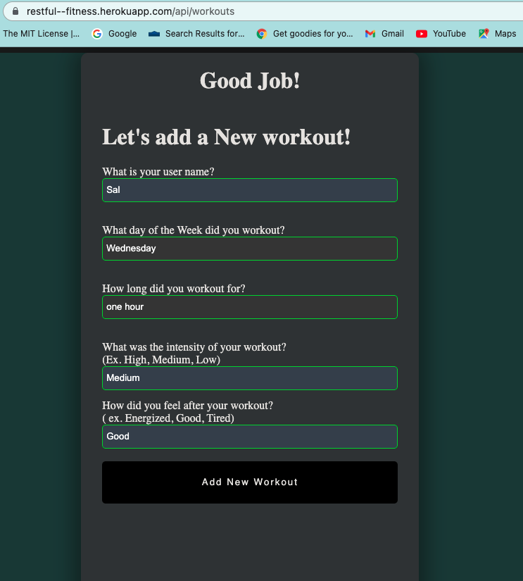

# Restful-Fitness

## __Description__

This application is a fitness-tracking tool designed to provide users with the ability to login to the app after registering as a new user, creating a secure personal profile to enter their demographics. 

The user will be taken to a main profile page that will display their profile information and an interactive water intake feature to assist the user in tracking daily water intake.

Users have the ability to add new workouts to be saved. 

The application also has a community blog page for users to post accomplishments and encouraging things for other users and find useful tips for wellness.

---


---

Open the app login page to login for existing users, or enter new user information in the "New User Registration" fields, then click "Register".


On the homepage, choose whether to add a new workout, go to the Community blog page, or logout from the navigation bar. 




You can add a new blog post on the Community page, to share information with other users, or read helpful fitness and wellness tips.


Back on the homepage, you can also add your water daily water intake by clicking one of the small cups located below the large cup, to indicate each 8 ounce glass of water consumed, and see the amount and percentage remaining to meet recommended daily goal of approximately 2 liters per day. You can double-click each cup to remove 8 ounces, if necessary or click a cup further ahead if you need to add multiple cups at one time.


---
## __Installation__
From the command-line run:
```
npm start
```

Then, enter:
```
node server.js
```
From your browser window, type or click the following link:
<https://restful--fitness.herokuapp.com/login>

---
### __Technology__

- HTML/CSS
- Javascript
- Node.js
- Express.js
- NPM
- Handlebars.js
- Bcrypt
- MySQL
- Sequelize
- Heroku
  
---

[Link to Deployed App on Heroku](https://restful--fitness.herokuapp.com/login)

---
#### __Authors__

[Shadae Brown](https://github.com/shadae96)

[Silvia Trejo](https://github.com/sytrejo)

[Heather Cooper](https://github.com/cheribc)

---
#### __License__

[MIT](https://opensource.org/licenses/MIT)


